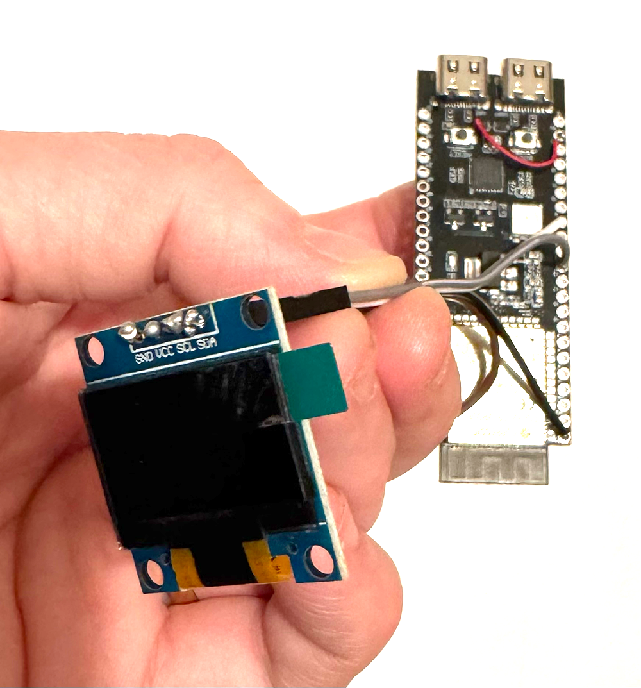
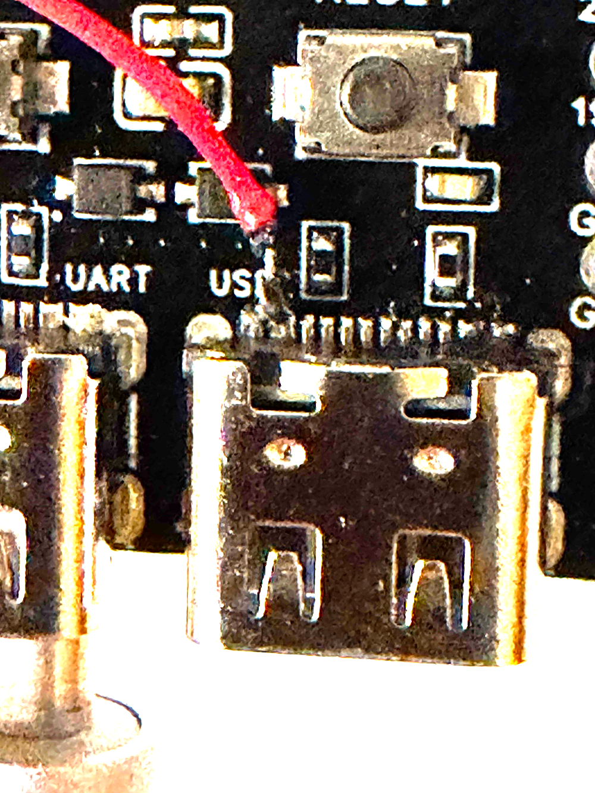
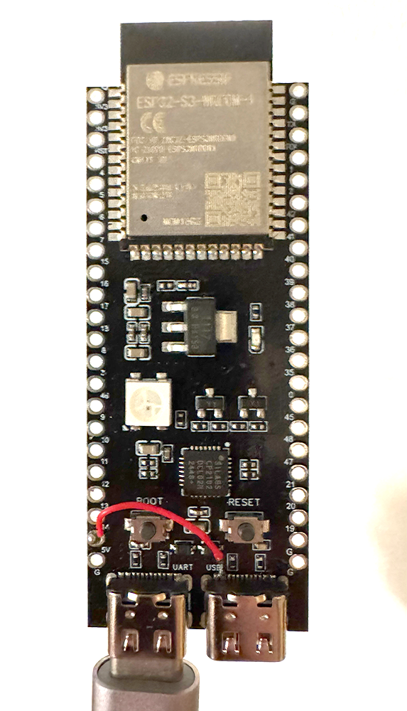

# BlueWalker Online
**BlueWalker Online** konverterar en ESP32-S3 till en NUT-server för Powerwalker UPS.  Då kan Unifi läsa UPS-data och alla datorer i nätverket kan ta del av UPS-information.

# Vad som behövs för att sätta upp en NUT-server
Du behöver ha en ESP32-S3 med dubbla USB-portar  
Den väntra USB-porten används för att ge ström och ladda upp projekt-uppdateringar.  
Den högra USB-porten används för att läsa data från Powerwalkern.

**Viktigt:** Du behöver löda +5V från ESP32:an till de stora benen till höger eller vänster på ESP32:ans högra USB-port eftersom ESP32 inte skickar ut 5V till USB-porten (den är USB-slav och det är bara USB-masters som skickar ut 5V). Därför behöver du ta 5V från ESP32 och skicka ut på ena benet.

Montera en liten OLED-skärm 128x64 (med fyra pinnar: 3V3, GND, SDA och SCL). Den visar vilken IP-adress enheten fått samt batteriprocent.  

`SDA = GPIO 8`  
`SCL = GPIO 9`

# Användning
**NUT:** UPS-servern använder sig av NUT (Network UPS Tools) som gör att enheter på nätverket kan få information från UPS:en.

För att kunna läsa UPS-information från NUT-servern – installera **nut** (`brew install nut`).
För att Mac ska övervaka UPS via NUT, kör `upsc ups@[IP]`. Exempelvis `upsc ups@10.21.0.136`.

**SNMP:** Enheten har också en SNMP-agent på port 161 som gör att Unifi och andra enheter som scannar SNMP automatiskt kan hitta den.

**WEBB:** BlueWalker Online har också en inbyggd webbserver så att du kan få information via en vanlig webbläsare.

**Komplett enhet:**  

**Lödning:**  

**Enhet:**  

